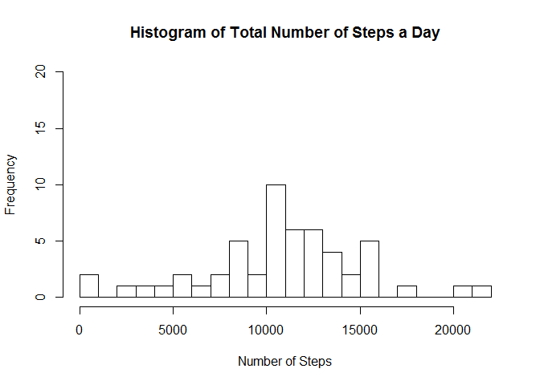
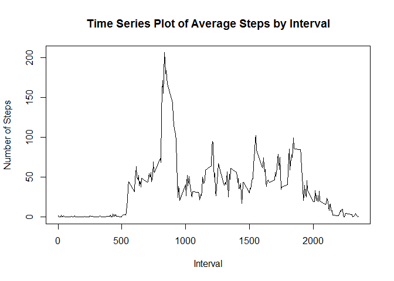
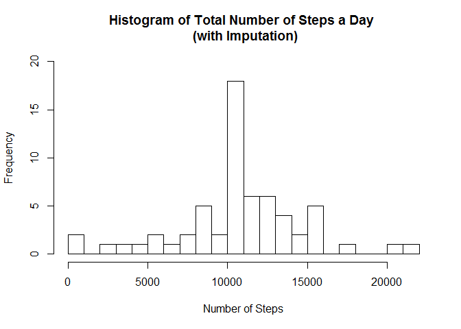
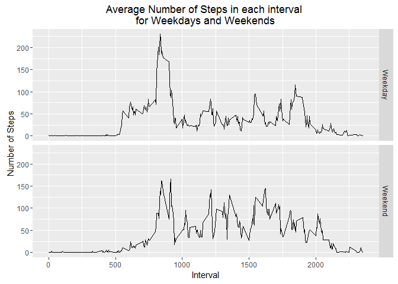

# Reproducible Research: Peer Assessment 1
## Load packages

```r
require(knitr)
require(lubridate)
require(dplyr)
require(ggplot2)
opts_chunk$set(echo=TRUE, warning=FALSE, message=FALSE)
```
## Loading and preprocessing the data
First, download the dataset into your working directory such that activity.csv is in your working directory.


```r
data=read.csv('activity.csv') 
data$date=ymd(data$date) # change dates from factor to date
```

## What is mean total number of steps taken per day?

Question asks us to ignore the missing values in the dataset. So first step is to remove these NA values such that they are ignored in the calculation.


```r
cdata=data[complete.cases(data),]
```
Then I calculate the total number of steps taken per day using summarise in the dplyr package, grouping by date.


```r
stepsperday=cdata %>% group_by(date) %>% summarise(totalsteps=sum(steps))
```

Next, I plot a histogram of total number of steps taken a day.


```r
hist(stepsperday$totalsteps, main='Histogram of Total Number of Steps a Day', xlab='Number of Steps', breaks=20, ylim=c(0,20))
```

<!-- -->

Finally, I calculate the mean and median number of steps taken a day.

```r
mean(stepsperday$totalsteps)
```

```
## [1] 10766.19
```

```r
median(stepsperday$totalsteps)
```

```
## [1] 10765
```


## What is the average daily activity pattern?
I calculate the mean number of steps, this time grouping by interval. I then plot the results taking care to specify the interval on the x-axis.


```r
stepsbyinterval=cdata %>% group_by(interval) %>% summarise(meansteps=mean(steps))
plot(stepsbyinterval$interval, stepsbyinterval$meansteps, type='l', 
     main='Time Series Plot of Average Steps by Interval', xlab='Interval', ylab='Number of Steps')
```

<!-- -->
<br>
To find out which interval has the highest average number of steps I use the which.max command.


```r
stepsbyinterval[which.max(stepsbyinterval$meansteps),]
```

```
## # A tibble: 1 x 2
##   interval meansteps
##      <int>     <dbl>
## 1      835  206.1698
```
## Imputing missing values
I count number of rows with NAs.

```r
table(complete.cases(data))[1]
```

```
## FALSE 
##  2304
```

Next I use a loop to replace all NAs with the mean value for the interval they occured in. This mean value was calculated in the previous section. I bind these imputed results with the observations I did not need to impute. 


```r
icdata=NULL
# Using mean value for period as a replacement for NAs
for (i in unique(data$interval)){
  icdatat=subset(data[!complete.cases(data),], interval==i)
  icdatat$steps=unlist(rep(subset(stepsbyinterval, interval==i)[2], nrow(subset(data[!complete.cases(data),], interval==i))))
  icdata=rbind(icdata,icdatat)
}
idata=rbind(cdata,icdata)
```

Next, I do a similar histogram by repeating the steps before on the new complete dataset with imputed and original data.


```r
istepsperday=idata %>% group_by(date) %>% summarise(totalsteps=sum(steps))
hist(istepsperday$totalsteps, main='Histogram of Total Number of Steps a Day \n (with Imputation)', xlab='Number of Steps', breaks=20, ylim=c(0,20))
```

<!-- -->

Notably, the only change in the histogram vis-a-vis before is an increase in the 10000-11000 bucket. This makes sense as all the missing values occured on days in which all the 'steps' readings were missing. These days all received the same number of steps as replacement and as such would appear in the histogram all in the same bucket. This can be confirmed with `subset(data, is.na(steps)) %>% group_by(date) %>% summarise(length(interval))`.

Finally, I calculated the mean and median as before. The limited change is probably due to how the days we added into the analysis have, by design, the mean number of steps in a day. 

```r
mean(istepsperday$totalsteps)
```

```
## [1] 10766.19
```

```r
median(istepsperday$totalsteps)
```

```
## [1] 10766.19
```

## Are there differences in activity patterns between weekdays and weekends?
First I create a factor to differentiate with weekdays and weekends. 


```r
idata = idata %>% mutate(dayofweek=weekdays(date))
idata = idata %>% mutate(daytype=ifelse(dayofweek %in% c('Saturday','Sunday'), 'Weekend', 'Weekday'))
idata$daytype = as.factor(idata$daytype)
idata$dayofweek=NULL
```

Then I repeat the earlier analysis with the enhanced dataset. This time, I split the dataset into weekdays and weekend in the time series plot.


```r
stepsbyinterval_dow=idata %>% group_by(interval, daytype) %>% summarise(meansteps=mean(steps))
qplot(interval,meansteps,data=stepsbyinterval_dow, facets= daytype ~ ., geom='line'
      ,ylab='Number of Steps', xlab='Interval', main='Average Number of Steps in each interval \nfor Weekdays and Weekends')
```

<!-- -->
